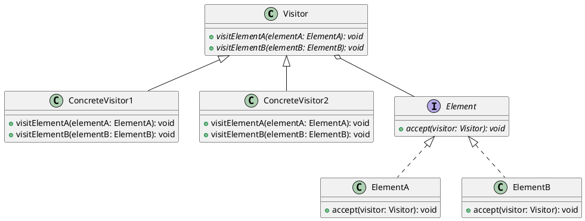

# Visitor Design Pattern
Visitor is a behavioral design pattern that lets you separate algorithms from the objects on which they operate.

## Overview
## Advantages
## Application
## Structure

## Code Examples
```cpp
struct Point
{
    double x;
    double y;
};

enum ShapeType
{
    circle,
    square
};

class Shape
{
protected:
    explicit Shape( ShapeType type )
    : type_( type )
    {}
public:
    virtual ~Shape() = default;
    ShapeType getType() const { return type_; }
private:
    ShapeType type_;
};
```
## Related design patterns
## External links
- [https://refactoring.guru/design-patterns/visitor](https://refactoring.guru/design-patterns/visitor)
- [https://en.wikipedia.org/wiki/Visitor_pattern](https://en.wikipedia.org/wiki/Visitor_pattern)
